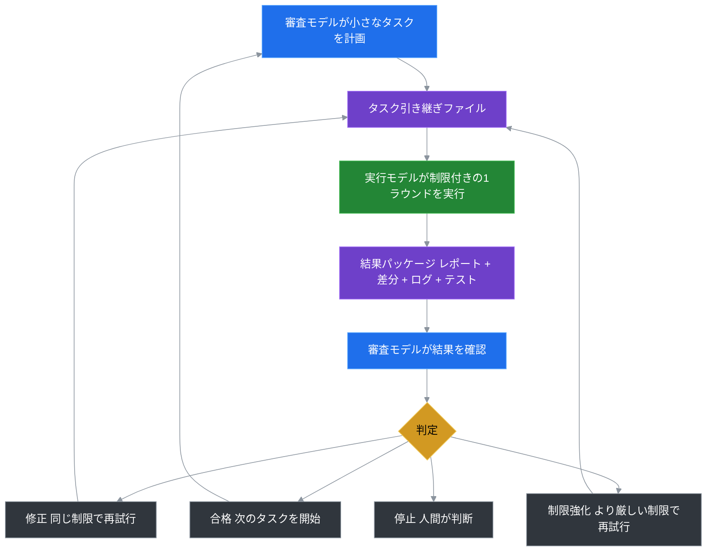

# Token Saver Loop

**Slogan：AIモデルの役割を分割し、高価格モデルのToken請求を最大75%削減**

Languages: [English](README.md) | [中文](README.zh-CN.md) | [日本語](README.ja.md) | [한국어](README.ko.md)

---

## クイックスタート（インストール不要）

Token Saver Loop は portable-only ツールです。インストーラーは実行しません。

1. このリポジトリの `portable/token-saver-kit` を、自分のプロジェクトのルートにコピーします。

   または、自分のプロジェクトルートで CMD を開き、次をそのまま実行します：

   ```cmd
   rmdir /S /Q "%TEMP%\token-saver-loop-kit" 2>NUL & git clone --depth 1 https://github.com/ningbo00/token-saver-loop.git "%TEMP%\token-saver-loop-kit" && xcopy "%TEMP%\token-saver-loop-kit\portable\token-saver-kit" "token-saver-kit" /E /I /Y && rmdir /S /Q "%TEMP%\token-saver-loop-kit"
   ```

   後で削除する方法：プロジェクトが完了した後、またはこの workflow が不要になった場合は、プロジェクトルートの `token-saver-kit` フォルダを削除するだけです。

2. reviewer モデルにこの固定プロンプトを送信します：

```text
Read token-saver-kit/START_HERE.md and act as reviewer only.
```

3. worker モデルにこの固定プロンプトを送信します：

```text
Read the latest token-saver-kit/.ai/active_task/rounds/round_NNN/worker_prompt.md and execute it.
```

4. worker が完了したら、この固定プロンプトを reviewer モデルに戻します：

```text
Review the latest token-saver-kit/.ai/active_task/rounds/round_NNN evidence.
```

---

## 一、ユーザーの核心的な悩み

主流の高価格汎用大モデルを使ってコード反復、リポジトリ整理、ドキュメント作成を行う際、ほぼ必ず3つの解決しがたい問題に遭遇します：

1. **請求の失控**：高価格Tokenの70%以上がファイル検索、繰り返しデバッグ、進捗報告などの低価値な肉体労働に消費され、意思決定はごくわずかなコストに過ぎません。

2. **タスクの発散**：単一モデルが自給自足するため、会話のコンテキストが長くなるほど、元の要件から外れ、過度にコードを変更しやすくなります。

3. **経験の流失**：セッションの記憶は一時的で脆弱です。プロジェクトの審査基準や失敗の記録はセッションをまたいで再利用できず、毎回使うたびに説明を繰り返す必要があります。

---

## 二、核心的なメリット（唯一の主メリット：高価格モデルのToken消費を削減）

核心的な根本論理：**AIの作業量を減らすのではなく、最も高価なモデルに肉体労働をさせないことで、高価格Tokenの請求を硬性的に圧縮する**

その他のすべての能力は付帯的な追加価値であり、プロジェクトの核心的なポジショニングではありません。

| 核心的なメリット | 実際の効果 |
|---|---|
| **高価格Tokenの大幅なコスト削減** | 高価格モデルの無駄なToken消費の90%を低価格モデルに移行し、通常のAI開発タスクで**高価格請求を75%削減** |

---

## 三、実際のコスト削減データの試算

### 3.1 同タスクのコスト比較

通常のコード最適化タスクを例に、従来の単一高価格モデルによるフルフローの消費が8000Tokenだった場合、改造後のコスト対比如下：

| 作業内容 | 従来の単一モデル（高価格Token） | Token Saver Loop（高価格Token） |
|---|---|---|
| タスク計画、リスク判定、最終検収 | 2000 | 2000 |
| リポジトリ検索、ソースコードの一括読み込み | 2400 | 0（低コスト実行モデルが引き受け） |
| コード修正、bugの再試行、テストの通過 | 2800 | 0（低コスト実行モデルが引き受け） |
| プロセスログ、進捗報告 | 800 | 0（ローカルファイルシステムが引き受け） |
| **高価格Token合計** | **8000** | **2000（75%削減）** |

メリットの境界：実行作業量が大きく、審査が核心的な結果のみを抜き打ちチェックする場合、コスト削減効果はより顕著になります。一度きりの極めて短いタスクではほぼメリットがありません。

### 3.2 高適合タスクリスト（優先使用）

| タスクシナリオ | コスト削減の原理 |
|---|---|
| 大規模リポジトリのソースコード探索、依存関係の整理 | 低価格モデルが数百ファイルを走査し、高価格モデルは最終的な整理結論のみを確認 |
| グローバルな一括命名、コメントの統一 | 低価格モデルが固定パターンを一括実行し、高価格モデルがdiffリスクを抜き打ちチェック |
| API連携、反復debug | 低価格モデルが繰り返しの再試行を引き受け、高価格モデルは最終的なエラーのみを振り返る |
| 多言語ドキュメントの初稿、長文ドキュメントの作成 | 低価格モデルが内容を埋め、高価格モデルが構造や専門用語を検証 |

---

## 四、適合／非適合シナリオ（迅速な自己判断）

### ✅ 使用に適する

- 実行と審査の双モデルを分離し、AIの誤ったコード変更を回避したい

- 複数のコードリポジトリを同時に保守し、AI開発基準を統一したい

- 超長いチャットコンテキストにうんざりし、ローカルファイルでタスク記録を永続的に残したい

- AIのファイル変更数を厳しく制限し、コア設定への権限超過変更を禁止したい

### ❌ 使用の必要なし

- 一度きりの短いQ&Aや単一ファイルの微小変更で、1ラウンドの会話で完了する

- コスト削減、リスク管理、経験の再利用のニーズがない

---

## 五、三役の最小限な役割分担

フレームワークは**完全にモデル非依存、バインドなし、デプロイ依存なし**。分かりやすい役割分担：私たちが必要なのは2種類の大モデルのみで、特定の製品にバインドする必要はありません：
1\. 低コスト汎用モデルまたは CLI（実行側）
2\. 高次推論モデル（審査側）

- **実行モデル（Worker）**：純粋な肉体労働。ファイル検索、コード編集、テスト実行、エラーの再試行、ログ／diffの出力。最終的な意思決定権はなし。

- **審査モデル（Reviewer）**：純粋な意思決定と管理。細粒度のタスク分割、操作境界の設定、変更結果の確認、最終的な裁决の提示。

- **ローカルファイルシステム**：永続的な記憶の载体。タスク工単、変更diff、審査ログ、プロジェクトルールを保存し、失われやすいチャットコンテキストに代わる。

---

## 六、60秒ゼロ障害で始める（直球の説明：一般人の使い方）

**一言で言う使用原理**：ソフトウェアのインストール不要、コーディング不要、キーの設定不要。プロジェクト内の1つのフォルダをコピーするだけで、2つのAIWebページを開き、それぞれに1つの定型フレーズを貼り付けると、セットのループが完了します。すべてローカルファイルを介して流れ、既存のコードは変更されません。

### 最小限の4ステップで始める（人間の言葉＋コピー指示の二合一、行き来する必要なし）

1. **ステップ1（ローカル準備）**：リポジトリ内の `portable/token-saver-kit` フォルダを、自分のプロジェクトのルートディレクトリにコピー＆ペーストする。

2. **ステップ2（審査モデルがタスクを配布）**：高次推論モデルを開き、下の reviewer 開始プロンプトを貼り付けます。計画のみを行い、プロジェクトのソースファイルを編集してはいけません。

3. **ステップ3（実行モデルが作業）**：worker モデルを開き、reviewer が準備した worker handoff prompt を貼り付けます。

4. **ステップ4（審査モデルが検収）**：高次推論モデルに戻り、下の reviewer レビュープロンプトを貼り付けます。

### 再利用する固定プロンプト

reviewer 開始：

```text
Read token-saver-kit/START_HERE.md and act as reviewer only.
```

worker 実行：

```text
Read the latest token-saver-kit/.ai/active_task/rounds/round_NNN/worker_prompt.md and execute it.
```

reviewer レビュー：

```text
Review the latest token-saver-kit/.ai/active_task/rounds/round_NNN evidence.
```

---

## 七、キットの核心ファイル説明

キットの状態は独立して保存され、**デフォルトでは既存のプロジェクトコードを能動的に変更しません。**

| ファイルパス | 核心用途 |
|---|---|
| `START_HERE.md` | 双モデルの統一エントリーポイント、基本使用制約の定義 |
| `WORKER_NEXT_TASK.md` | 現在のラウンドで実行モデルに配布する具体的なタスク |
| `REVIEWER_CONTINUE.md` | 新規審査セッション時のコンテキストガイドファイル |
| `.ai/active_task/` | ラウンドログ、変更diff、裁决結果のローカル保存 |
| `tools/` | タスク初期化、一括審査補助スクリプト |

---

## 八、完全なクローズドループワークフロー（理解するだけで、手動操作は不要）

フロー概要：審査がタスクを分割→ファイル引き継ぎ→実行の着地→結果パッケージの産出→審査の四方向裁决→ループ反復



裁决分岐の説明：合格／同レベル修正／権限制限の強化によるダウングレード／人間による停止。4種類のクローズドループに漏れはなし。

---

## 九、品質、リスク、長期的な懸念への回答

コスト削減以外で、ユーザーが最も気にしている4つの潜在的な懸念：コスト削減はコード品質を犠牲にするのか？タスクは逸脱しないか？経験は再利用できるか？複数プロジェクトで通用するか？以下は、追加料金なし、Token消費の増加なしで付帯する完全な保証です：

1. **タスクの失控を回避（逸脱防止）**：各ラウンドのタスクでファイル変更範囲と操作権限を限定し、モデルの境界なき自由発揮を遮断し、長い会話での要件逸脱問題を解決する。

2. **自己審査の盲点を排除（品質保証）**：実行モデルと審査モデルを物理的に分離し、単一モデルの自己変更・自己審査、脆弱性の見落とし、自己美教化という通病を回避する。

3. **長期的な複利効率向上（付帯的なコスト削減効果）**：使用し続けることで、プロジェクトはAI呼び出しルールや失敗基準を蓄積し、以降モデルに毎回説明を繰り返す必要がなく、さらに潜在的な無駄なToken消費を削減する。

4. **ゼロコストでプロジェクトをまたいで再利用**：フレームワーク依存がなく、ポータブルキットをコピーするだけで任意のリポジトリに接続でき、すべてのリポジトリのAI開発基準を統一する。

元の独立した安全リスク管理項目は、品質の懸念と統合して簡潔化され、内容の分断を回避しています：

1. **権限分離と誤変更防止**：実行モデルに最終的な意思決定権はなく、すべての変更は審査と検証を受ける必要があり、デフォルトで自動Gitコミットは禁止されている。

2. **4段階の権限セーフティネット**：読み取り専用のT0から始め、段階的に変更権限を開放し、コア設定への権限超過変更を根絶する。

3. **結果指向の検証**：コードのdiffとテストログのみを検証し、モデルの口頭報告は信用せず、言葉巧みな虚偽を回避する。

4. **ポータブルな削除**：実行状態は `token-saver-kit/` 内に保存されるため、ループを削除するにはこのフォルダを削除するだけでよい。

---

## 十、上級の使い方（初心者の99%は使わないので、直接スキップ可）

### 10.1 最小限の安全な例

`examples/minimal-task.md` を参照。コード変更ゼロのT0リポジトリ巡回タスクを提供し、初回のフロー検証に適している。

### 10.2 開発者向け補助ツール

Python パッケージには、貢献者向けの任意の診断・メトリクス補助機能があります。通常の portable workflow では不要です。

---

## 十一、初心者のよくあるFAQ

- **Q：特定の worker + reviewer モデルの組み合わせが必要ですか？** A：全く必要ありません。キットはあくまで例です。任意の「低価格実行モデル＋高価格審査モデル」の組み合わせに置き換え可能で、キット内部ファイルを変更する必要はありません。

- **Q：既存のプロジェクトファイルが汚染されますか？** A：すべての実行データはキット内部の\.aiディレクトリに保存され、デフォルトではソースコードのみを読み取り、プロジェクトの業務ファイルには能動的に書き込みません。

- **Q：フローが分からない場合、どこで学べますか？** A：完全な初心者は、**docs/BEGINNER\_GUIDE\.md** を直接読んでください。図文によるステップバイステップのチュートリアルがあります。

---

## 十二、プロジェクト状態とオープンソースライセンス

### 12.1 機能進捗

| 機能 | 状態 |
|---|---|
| インストール不要のポータブルキット | 完了（portableディレクトリ） |
| 初心者向け図文ガイド、最小例 | 完了 |
| Python CLIインストーラー、Token指標統計 | 完了 |
| クロスモデル汎用テンプレート、タスク診断コマンド | 計画中 |

### 12.2 ライセンス

MIT License。自由な商用利用、二次変更・配布を許可する。

> （注：ドキュメントの一部の内容はAIによって生成されている可能性があります）
