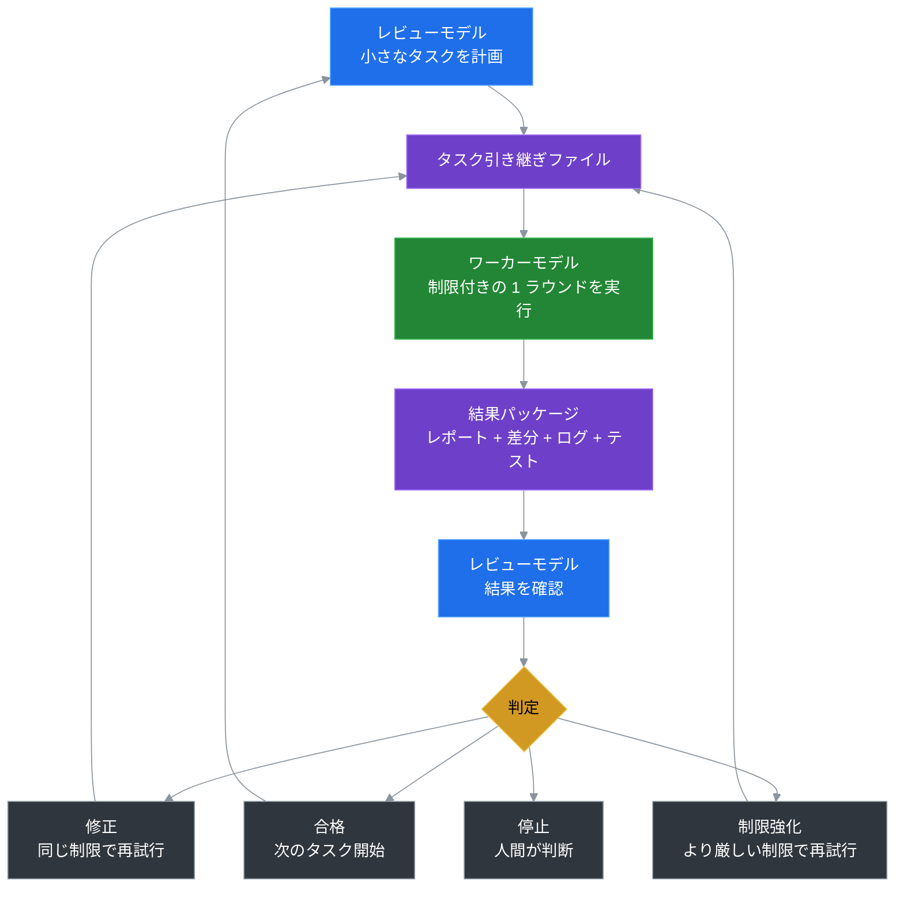

# Token Saver Loop

> 検索、実行、再試行、記憶を高コストモデルのループから外し、計画と最終レビューは高コストモデルの手元に残す。

Languages: [English](README.md) | [中文](README.zh-CN.md) | [日本語](README.ja.md) | [한국어](README.ko.md)

Token Saver Loop は、1 つのコードプロジェクトで 2 つの AI 役割を使うためのポータブルワークフローです：

```text
ワーカーモデル   = 検索、編集、チェック実行、再試行、結果書き出し
レビューモデル   = 計画、制限設定、結果レビュー、合格/修正/停止の判定
ファイルシステム = メモリ、タスク、レポート、差分、ログ、判定の保存
```

デフォルト設定は **Kimi をワーカー + Codex をレビュアー** ですが、この考え方はモデルに依存しません。重要なのはループの仕組みであり、ブランド名ではありません。

## 1. トークンはどこで節約されるか

Token は、高コストモデルが低価値の作業から解放されることで節約されます。

通常の単一モデルのコーディングワークフローでは、最強のモデルがすべてをこなすことが多いです：

```text
広いコンテキスト読み込み -> ファイル検索 -> 編集 -> テスト実行 -> エラー発生 -> 再試行 -> 説明 -> 次のターン繰り返し
```

これはプレミアムトークン を、本当にプレミアムな判断が必要でない作業に消費します：

- 広範なリポジトリ検索
- 試行錯誤的な編集
- 繰り返されるテスト/デバッグループ
- 長いチャット履歴の再読み込み
- 進捗報告やステータス要約

Token Saver Loop はコスト構造を変えます：

```text
高コストモデル: 計画、制約、受け入れ判断、リスク判断
ワーカーモデル:  検索、実行、再試行、コマンド出力、レポート
ファイルシステム: 長いチャットコンテキストの代わりに永続的な記憶
```

つまり節約は魔法ではありません。最強モデルに実行ループ全体をひたすらやらせるのをやめ、本当にそのモデルの判断が必要な部分だけに集中させるのです。

## 2. なぜこのループは信頼できるか

このループは信頼できるのは、ワーカーは実行を許されるが、決定を許されないからです。

これは単に安価なモデルを直接使うこととの決定的な違いです。ワーカーは検索、編集、テスト、再試行ができますが、レビュアーが依然として以下をコントロールします：

- タスクが何であるか
- ワーカーにどれだけの自由度があるか
- 結果が受け入れられるか
- 次のラウンドを修正、制限強化、停止のどれにすべきか

単一の強いモデルをエンドツーエンドで使う場合と比較して、Token Saver Loop はいくつかの信頼性の落とし穴を回避します：

| 単一モデルワークフローのリスク | ループの回答 |
|---|---|
| 同じモデルが作業と自己レビューの両方を行う。 | ワーカーが実行し、レビュアーは実行パス外から判定する。 |
| 大きなタスクが時間とともにずれていく。 | 各ラウンドはタスク範囲とティアによって制限される。 |
| モデルが自身の失敗を正当化する。 | 失敗は制御アクションになる：修正、制限強化、停止。 |
| 長いチャットが元の要件を薄める。 | 現在のタスク、状態、レビュー規則はファイルに存在する。 |
| 間違いが広範な編集を通じて広がる。 | ラウンド制限が影響範囲を小さくする。 |

品質はワーカーを信頼することから生まれません。品質は、ワーカーに作業を任せつつ、判断、受け入れ、リスクコントロールをレビュアーに残すことから生まれます。

## 3. なぜ時間とともに良くなるか

Token Saver Loop は改善します。なぜなら各ラウンドが経験を再利用可能なプロジェクト知識に変えるからです。

通常のチャットは長くて煩雑になります。このループは鋭くなるべきです。時間とともに、プロジェクトは以下の質問に対するより良い答えを蓄積します：

- どのタスクサイズが最も効果的か？
- ワーカーが避けるべきフォルダはどこか？
- この種の変更で必須のテストはどれか？
- このワーカーはどんな間違いをよく犯すか？
- レビュアーはいつ T2 から T1 に制限強化すべきか？
- このリポジトリで良いタスク引き継ぎはどのようなものか？

これは、未来のラウンドが初期のラウンドより良い境界から始まることを意味します。改善は 1 つのモデルの壊れやすいチャット記憶に保存されるのではなく、プロジェクトファイル、タスクテンプレート、レビュー習慣、蓄積された規則に保存されます。

要するに：

```text
モデルが魔法のようにもっと覚える必要はない。
プロジェクトがモデルをより上手に使う方法を学んでいる。
```

## はじめての方へ

GitHub、Codex/Kimi ワークフロー、コマンドラインツールに不慣れな方は、ここから始めてください：

```text
docs/BEGINNER_GUIDE.md
```

このガイドは最もシンプルなパスを案内します：キットをコピーし、Codex に安全な初タスクを依頼し、Kimi に実行させ、Codex に結果をレビューしてもらいます。

## 基本ループ



## 60 秒クイックスタート

Python は不要です。パッケージインストールも不要です。PowerShell ヘルパースクリプトはオプションです。

1. このフォルダを別のプロジェクトにコピーします：
   ```text
   portable/kimi-codex-kit/
   ```

2. Codex で言います：
   ```text
   Read kimi-codex-kit/START_HERE.md and create a safe first worker task.
   ```

3. Kimi で言います：
   ```text
   Read kimi-codex-kit/KIMI_NEXT_TASK.md and execute it against this project.
   ```

4. Codex に戻って言います：
   ```text
   The worker is done. Review the latest round evidence.
   ```

スクリプトを使いたい？Kimi を実行せずにワーカープロンプトを生成できます：

```powershell
powershell -ExecutionPolicy Bypass -File kimi-codex-kit/tools/ai-kimi-init.ps1 -Task "Inspect this project and summarize the structure" -Tier T0
powershell -ExecutionPolicy Bypass -File kimi-codex-kit/tools/ai-kimi-run.ps1 -NoRun
```

## プロジェクトにコピーするもの

| パス | 用途 |
|---|---|
| `START_HERE.md` | レビュアー/ワーカーモデルが最初に読むファイル。 |
| `KIMI_NEXT_TASK.md` | 現在の制限付きワーカータスク。 |
| `CODEX_CONTINUE.md` | 新しいレビュアースレッドのブートストラップ。 |
| `KIMI_CODEX_LOOP.md` | デフォルト Kimi/Codex 設定の完全なワークフローノート。 |
| `tools/` | オプションの PowerShell ヘルパー：初期化、実行、レビューパック、判定。 |
| `skills/kimi-codex-worker.md` | Kimi のデフォルトワーカー指示。 |
| `.ai/active_task/` | キットローカル状態、進捗、ラウンド履歴。 |

コピーされたキットはワークフロー状態を `kimi-codex-kit/.ai/` 内に保持するため、親プロジェクトは実際に承認したタスクによる変更のみを受けます。

## 初タスクの例

安全な T0 調査専用タスクについては `examples/minimal-task.md` を参照してください。ソースコードを変更せずにプロジェクトを要約するようワーカーに求めます。

## オプション：Python CLI

ポータブルフォルダが推奨パスです。Python インストーラーを好む場合：

```bash
pip install -e .
token-saver-loop --install --yes --project-name MyApp --test-command "pytest"
```

## いつ使うか

Token Saver Loop を使うべきとき：

- 1 つのモデルに実行させ、別のモデルにレビューさせたい。
- 複数のリポジトリで再現可能な AI 開発プロセスが必要。
- 長いチャットメモリの代わりに証拠に基づく引き継ぎが欲しい。
- ワーカーの自由度と変更ファイル数をより厳密に管理したい。

使わないべきとき：

- ワンショットの回答だけが必要。
- タスクが小さく、1 つのモデルで 1 回のチャットで済む。
- トークン節約、レビューゲート、ファイルベースの履歴が不要。

## 安全モデル

- **ワーカーが実行し、レビュアーが判断する。** ワーカーに最終決定権はない。
- **デフォルトでコミットしない。** Git 履歴は人間/レビュアーが管理する。
- **結果からレビューし、自己信頼ではない。** レビュアーはワーカーの自信ではなく結果を確認する。
- **段階的な自由度。** T0 調査専用、T1 精密、T2 制限付き、T3 広範。
- **インストーラー安全。** 実際のインストールには `--yes` が必要で、上書き防止チェックを使用。

## プロジェクト状況

| 機能 | 状況 |
|---|---|
| ポータブルインストール不要キット | `portable/kimi-codex-kit/` で利用可能 |
| ビギナーズガイド | `docs/BEGINNER_GUIDE.md` で利用可能 |
| 最小例 | `examples/minimal-task.md` で利用可能 |
| Python CLI インストーラー | `pip install -e .` で利用可能 |
| Token 使用ヘルパー | JSONL 解析とメトリクスヘルパー |
| レビュアー判定 | 合格 / 同レベル修正 / 制限強化 / 停止 |
| 将来：診断コマンド | 計画中 |
| 将来：モデル非依存テンプレート | 計画中 |

## ライセンス

MIT
