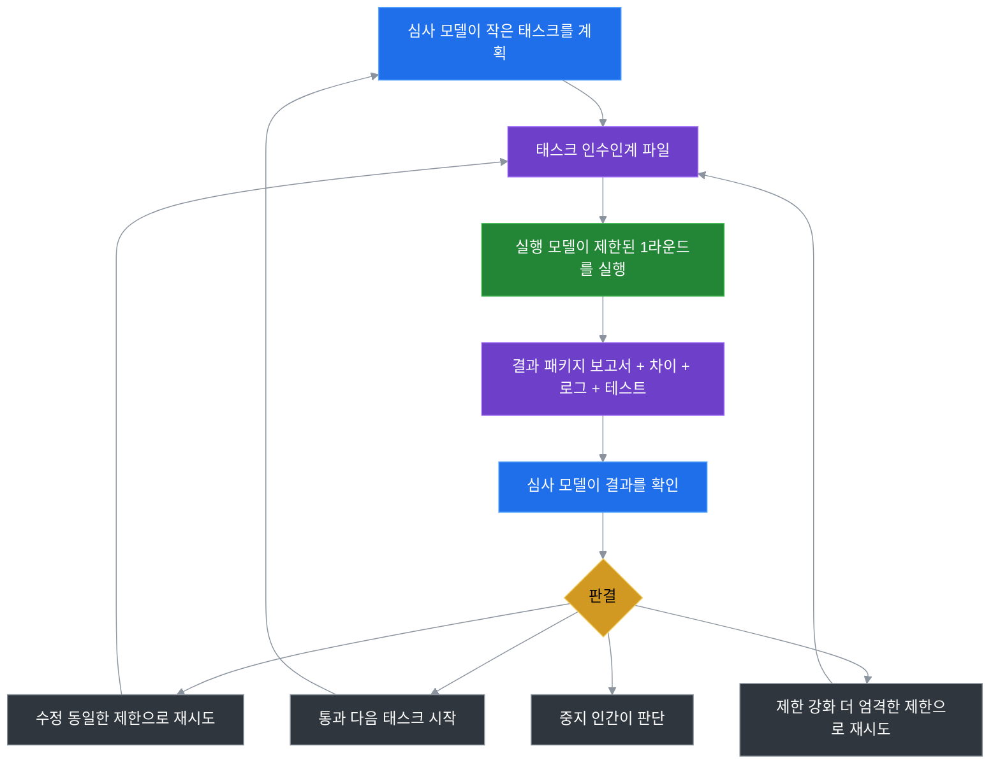

# Token Saver Loop

**Slogan：AI 모델 역할을 분할하여 고가 모델 Token 청구서를 최대 75% 절감**

Languages: [English](README.md) | [中文](README.zh-CN.md) | [日本語](README.ja.md) | [한국어](README.ko.md)

---

## 一、사용자 핵심 고통 포인트

GPT, Claude 등 주류 고가 범용 대형 모델을 사용하여 코드 반복, 리포지토리 정리, 문서 작성을 할 때, 거의 항상 세 가지 해결하기 어려운 문제에 부딪힙니다:

1. **청구서 통제 불가**：고가 Token의 70% 이상이 파일 검색, 반복 디버깅, 진행 상황 보고 등 저가치 육체노동에 소비되며, 의사결정은 극소수의 비용에 불과합니다.

2. **태스크 발산**：단일 모델이 자급자족하므로, 대화 컨텍스트가 길어질수록 원래 요구사항에서 벗어나 과도하게 코드를 수정하기 쉽습니다.

3. **경험 유실**：세션 메모리는 일시적이고 취약합니다. 프로젝트 심사 기준이나 실패 기록은 세션 간에 재사용할 수 없어, 매번 사용할 때마다 반복해서 설명해야 합니다.

---

## 二、핵심 수익（유일한 주 수익：고가 모델 Token 소비 절감）

핵심 근본 로직：**AI 작업량을 줄이는 것이 아니라, 가장 비싼 모델이 육체노동을 하지 못하게 하여 고가 Token 청구서를 강제로 억제하는 것**

그 외의 모든 기능은 부가적인 이득이며, 프로젝트의 핵심 포지셔닝에 해당하지 않습니다.

| 핵심 수익 | 실제 효과 |
|---|---|
| **고가 Token 대폭적인 비용 절감** | 고가 모델의 무효 Token 소비 90%를 저가 모델로 전환하여, 일반 AI 개발 태스크에서 **고가 청구서를 75% 절감** |

---

## 三、실제 비용 절감 데이터 추산

### 3.1 동일 태스크 비용 비교

일반적인 코드 최적화 태스크를 예로 들어, 기존 단일 고가 모델의 전체 프로세스 소비가 8000Token이었다면, 개조 후 비용 대비는 다음과 같습니다:

| 작업 내용 | 기존 단일 모델（고가 Token） | Token Saver Loop（고가 Token） |
|---|---|---|
| 태스크 계획, 리스크 판정, 최종 검수 | 2000 | 2000 |
| 리포지토리 검색, 소스코드 일괄 읽기 | 2400 | 0（저비용 실행 모델이 담당） |
| 코드 수정, bug 재시도, 테스트 통과 | 2800 | 0（저비용 실행 모델이 담당） |
| 프로세스 로그, 진행 상황 보고 | 800 | 0（로컬 파일 시스템이 담당） |
| **고가 Token 총계** | **8000** | **2000（75% 절감）** |

수익 경계：실행 작업량이 크고, 심사가 핵심 결과만 선별 검사할 때 비용 절감 효과가 더 뚜렷합니다. 일회성 극도로 짧은 태스크에서는 거의 수익이 없습니다.

### 3.2 높은 적합성 태스크 목록（우선 사용）

| 태스크 시나리오 | 비용 절감 원리 |
|---|---|
| 대형 리포지토리 소스코드 탐색, 의존성 정리 | 저가 모델이 백 단위 파일을 순회하고, 고가 모델은 최종 정리 결론만 확인 |
| 전역 일괄 명명, 주석 통일 | 저가 모델이 고정 패턴을 일괄 실행하고, 고가 모델이 diff 리스크를 선별 검사 |
| API 연동, 반복 debug | 저가 모델이 반복 재시도를 담당하고, 고가 모델은 최종 에러만 복기 |
| 다국어 문서 초안, 장문 문서 작성 | 저가 모델이 내용을 채우고, 고가 모델이 구조와 전문 용어를 검증 |

---

## 四、적합／비적합 시나리오（빠른 자가 판단）

### ✅ 사용에 적합

- 실행, 심사 이중 모델 분리가 필요하여 AI의 잘못된 코드 수정을 회피하고자 하는 경우

- 여러 코드 리포지토리를 동시에 유지하며, AI 개발 기준을 통일하고자 하는 경우

- 초장 대화 컨텍스트에 지쳐, 로컬 파일로 태스크 기록을 영구 보존하고자 하는 경우

- AI의 파일 수정 수를 엄격히 제한하고, 핵심 설정에 대한 권한 초과 변경을 금지하고자 하는 경우

### ❌ 사용 불필요

- 일회성 짧은 Q&A나 단일 파일의 미세 수정으로, 한 라운드 대화로 완료 가능한 경우

- 비용 절감, 리스크 관리, 경험 재사용 수요가 없는 경우

---

## 五、삼방 역할 최소 분공

프레임워크는 **완전히 모델 무관, 바인딩 없음, 배포 의존성 없음**. 통속적인 역할 구분：우리가 필요한 것은 두 종류의 대형 모델뿐이며, 특정 제품에 바인딩할 필요가 없습니다：
1\. 저비용 범용 대형 모델（실행 단：Kimi／통의천문 등）
2\. 고급 추론 대형 모델（심사 단：GPT／Claude 등）

- **실행 모델（Worker）**：순수 육체노동. 파일 검색, 코드 편집, 테스트 실행, 에러 재시도, 로그／diff 산출. 최종 의사결정권 없음.

- **심사 모델（Reviewer）**：순수 의사결정 및 통제. 미세 입자도 태스크 분할, 작업 경계 설정, 변경 결과 검증, 최종 판결 부여.

- **로컬 파일 시스템**：영구 기억 매체. 태스크 공수표, 변경 diff, 심사 로그, 프로젝트 규칙을 저장하여, 유실되기 쉬운 채팅 컨텍스트를 대체합니다.

---

## 六、60초 제로 문턱 시작（직설적 설명：일반인의 사용법）

**한 마디 사용 원리**：소프트웨어 설치 불필요, 코딩 불필요, 키 설정 불필요. 프로젝트 내 하나의 폴더만 복사하여, 두 개의 AI 웹 페이지를 열고, 각각 고정 멘트를 하나 붙여넣으면 전체 루프가 완료됩니다. 전 과정 로컬 파일 흐름, 기존 코드를 변경하지 않습니다.

### 최소 4단계 시작（인간어＋복사 지시문 이합일, 왕복 전환 불필요）

1. **단계1（로컬 준비）**：리포지토리 내 `portable/kimi-codex-kit` 폴더를 자신의 프로젝트 루트 디렉터리에 복사하여 붙여넣기

2. **단계2（심사 모델이 태스크 배포）**：고급 추론 대형 모델을 열고, 직접 복사하여 전송：`Read kimi-codex-kit/START_HERE.md and create a safe first worker task.`

3. **단계3（실행 모델이 작업）**：저비용 대형 모델을 열고, 직접 복사하여 전송：`Read kimi-codex-kit/KIMI_NEXT_TASK.md and execute it against this project.`

4. **단계4（심사 모델이 검수）**：고급 추론 대형 모델로 돌아와, 직접 복사하여 전송：`The worker is done. Review the latest round evidence.`

### 선택：PowerShell 단축 생성 태스크（수동 멘트 입력 불필요）

```powershell
# 리포지토리 정리 태스크 초기화
powershell -ExecutionPolicy Bypass -File kimi-codex-kit/tools/ai-kimi-init.ps1 -Task "Inspect this project and summarize the structure" -Tier T0
# 실행 지시문 생성 후 직접 실행하지 않음
powershell -ExecutionPolicy Bypass -File kimi-codex-kit/tools/ai-kimi-run.ps1 -NoRun
```

---

## 七、킷 핵심 파일 설명

킷 상태는 독립 저장되며, **기본적으로 기존 프로젝트 코드를 능동적으로 수정하지 않습니다.**

| 파일 경로 | 핵심 용도 |
|---|---|
| `START_HERE.md` | 이중 모델 통일 진입점, 기본 사용 제약 정의 |
| `KIMI_NEXT_TASK.md` | 현재 라운드에서 실행 모델에 배포하는 구체적 태스크 |
| `CODEX_CONTINUE.md` | 신규 심사 세션 시의 컨텍스트 가이드 파일 |
| `.ai/active_task/` | 로컬 저장 라운드 로그, 변경 diff, 판결 결과 |
| `tools/` | 태스크 초기화, 일괄 심사 보조 스크립트 |

---

## 八、완전한 클로즈드룹 워크플로우（이해하면 충분, 수동 조작 불필요）

프로세스 간략 설명：심사가 태스크를 분할→파일 인수인계→실행 착지→결과 패키지 산출→심사 사방향 판결→루프 반복



판결 분기 설명：통과／동급 수정／권한 수축 다운그레이드／인간 종료. 네 종류의 클로즈드룹에 누락이 없음.

---

## 九、품질, 리스크 및 장기적 고민 해답

비용 절감 외에 사용자가 가장 신경 쓰는 4가지 잠재적 고민：비용 절감이 코드 품질을 희생하는가？태스크가 벗어나는가？경험을 재사용할 수 있는가？여러 프로젝트에 통용되는가？다음은 추가 비용 없이, Token 소비를 증가시키지 않는 전체 부대 보장입니다：

1. **태스크 통제 불가 방지（벗어남 방지）**：매 라운드 태스크에서 파일 수정 범위와 작업 권한을 제한하여, 모델의 무경계 자유 발휘를 차단하고, 긴 대화의 요구사항 벗어남 문제를 해결합니다.

2. **자체 심사 사각지대 제거（품질 보장）**：실행 모델과 심사 모델을 물리적으로 분리하여, 단일 모델의 자체 수정·자체 심사, 취약점 간과, 자기 미화라는 고질병을 회피합니다.

3. **장기적 복리 효율 향상（부대 비용 절감 효과）**：사용하면서 프로젝트가 AI 호출 규칙과 실패 기준을 축적하게 되어, 이후 모델에 매번 반복해서 설명할 필요가 없어, 추가로 잠재적인 무효 Token 소비를 절감합니다.

4. **제로 비용으로 프로젝트를 넘어 재사용**：프레임워크 의존성이 없어, 휴대용 킷을 복사하면 임의의 리포지토리에 접속할 수 있고, 전체 리포지토리의 AI 개발 기준을 통일합니다.

기존의 독립적인 안전 리스크 관리 항목은 품질 고민과 통합하여 간결화되었으며, 내용의 단절을 회피합니다：

1. **권한 분리 및 오수정 방지**：실행 모델에 최종 의사결정권이 없으며, 모든 변경은 심사 검증을 거쳐야 하고, 기본적으로 자동 Git 커밋을 금지합니다.

2. **4단계 권한 안전망**：읽기 전용 T0에서 시작하여, 단계적으로 수정 권한을 개방하여, 핵심 설정에 대한 권한 초과 변경을 근절합니다.

3. **결과 지향 검증**：코드 diff와 테스트 로그만을 검증하고, 모델의 구두 보고는 채택하지 않아, 말빨 조작을 회피합니다.

4. **설치 시 덮어쓰기 방지**：CLI 설치에는 인간의 확인이 필요하며, 자체 파일 충돌 감지를 탑재하여 기존 업무 코드를 보호합니다.

---

## 十、고급 사용법（신규 사용자의 99%는 사용하지 않으므로, 직접 스킵 가능）

### 10.1 최소 안전 예시

`examples/minimal-task.md`를 참조. 코드 변경 제로의 T0 리포지토리 순찰 태스크를 제공하며, 첫 번째 프로세스 검증에 적합함.

### 10.2 Python CLI 설치（일괄 운용 시나리오）

```bash
pip install -e .
token-saver-loop --install --yes --project-name MyApp --test-command "pytest"
```

적용 시나리오：다수 리포지토리에서 킷을 일괄 초기화. 개인 일상 사용에서는 휴대용 폴더를 우선시함.

---

## 十一、신규 사용자 고빈도 FAQ

- **Q：Kimi＋특정 모델을 반드시 사용해야 하나요？** A：전혀 필요하지 않습니다. 킷은 단지 기본 예시일 뿐입니다. 임의의 「저가 실행 모델＋고가 심사 모델」 조합으로 교체 가능하며, 킷 내부 파일을 변경할 필요가 없습니다.

- **Q：기존 프로젝트 파일이 오염되나요？** A：모든 실행 데이터는 킷 내부의\.ai 디렉터리에 저장되며, 기본적으로 소스코드만 읽고, 프로젝트 업무 파일에는 능동적으로 쓰지 않습니다.

- **Q：프로세스를 이해하지 못하면 어디서 학습하나요？** A：완전한 초보자는 **docs/BEGINNER\_GUIDE\.md**를 직접 읽으세요. 그림문자 단계별 튜토리얼이 있습니다.

---

## 十二、프로젝트 상태 및 오픈소스 라이선스

### 12.1 기능 진도

| 기능 | 상태 |
|---|---|
| 설치 불필요 휴대용 킷 | 완료（portable 디렉터리） |
| 신규 사용자 그림문자 가이드, 최소 예시 | 완료 |
| Python CLI 인스톨러, Token 지표 통계 | 완료 |
| 크로스 모델 범용 템플릿, 태스크 진단 명령 | 계획 중 |

### 12.2 라이선스

MIT License. 자유로운 상업 이용, 2차 수정 및 재배포를 허용합니다.

> （주：문서의 일부 내용은 AI에 의해 생성되었을 수 있습니다）
