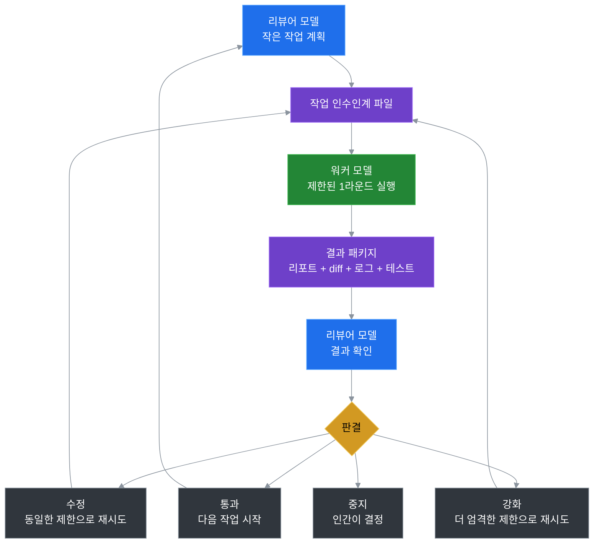

# Token Saver Loop

> 검색, 실행, 재시도, 기억을 고비용 모델 루프에서 분리하고, 계획과 최종 검토는 고비용 모델이 담당하게 한다.

Languages: [English](README.md) | [中文](README.zh-CN.md) | [日本語](README.ja.md) | [한국어](README.ko.md)

Token Saver Loop은 하나의 코딩 프로젝트에서 두 가지 AI 역할을 사용하는 이식 가능한 워크플로우입니다:

```text
워커 모델   = 검색, 편집, 체크 실행, 재시도, 결과 기록
리뷰어 모델 = 계획, 제한 설정, 결과 검토, 통과/수정/중지 결정
파일 시스템 = 메모리, 작업, 리포트, diff, 로그, 판결 저장
```

기본 설정은 **Kimi를 워커 + Codex를 리뷰어**로 하는 것이지만, 이 아이디어는 모델에 의존하지 않습니다. 중요한 것은 브랜드 이름이 아니라 루프 메커니즘입니다.

## 1. 토큰은 어디에서 절약되는가

토큰은 고비용 모델이 저가치 작업을 하지 않도록 하여 절약됩니다.

일반적인 단일 모델 코딩 워크플로우에서는 가장 강력한 모델이 모든 것을 처리하는 경우가 많습니다:

```text
넓은 컨텍스트 읽기 -> 파일 검색 -> 편집 -> 테스트 실행 -> 에러 발생 -> 재시도 -> 설명 -> 다음 턴 반복
```

이는 프리미엄 토큰을 실제로 프리미엄 판단이 필요하지 않은 작업에 소비합니다:

- 넓은 리포지토리 검색
- 시행착오식 편집
- 반복되는 테스트/디버그 루프
- 긴 채팅 기록 재생
- 진행 상황 서술 및 상태 요약

Token Saver Loop은 비용 구조를 바꿉니다:

```text
고비용 모델: 계획, 제약, 수락, 리스크 판단
워커 모델:   검색, 실행, 재시도, 명령 출력, 리포트
파일 시스템: 긴 채팅 컨텍스트 대신 내구성 있는 메모리
```

따라서 절약은 마법이 아닙니다. 가장 강력한 모델에게 실행 루프 전체를 끝없이 돌리지 않고, 실제로 그것이 필요한 결정 부분에만 집중하도록 하는 것입니다.

## 2. 왜 이 루프는 신뢰할 수 있는가

이 루프가 신뢰할 수 있는 이유는 워커는 실행할 수 있지만 결정할 수는 없기 때문입니다.

이는 단순히 저렴한 모델을 직접 사용하는 것과의 핵심적인 diff점입니다. 워커는 검색, 편집, 테스트, 재시도를 할 수 있지만, 리뷰어가 여전히 다음을 제어합니다:

- 작업가 무엇인지
- 워커에게 얼마나 많은 자유도가 있는지
- 결과가 수락되는지
- 다음 라운드를 수정, 강화, 중지 중 무엇으로 할지

하나의 강력한 모델을 엔드투엔드로 사용하는 것과 비교했을 때, Token Saver Loop은 여러 신뢰성 함정을 피합니다:

| 단일 모델 워크플로우의 리스크 | 루프의 해결책 |
|---|---|
| 동일한 모델이 작업과 자체 작업 검토를 모두 수행한다. | 워커가 실행하고, 리뷰어는 실행 경로 외부에서 판단한다. |
| 큰 작업가 시간이 지남에 따라 변질된다. | 각 라운드는 작업 범위와 티어로 제한된다. |
| 모델이 자신의 실패한 시도를 정당화한다. | 실패는 제어 액션이 된다: 수정, 강화, 중지. |
| 긴 채팅이 원래 요구사항을 희석시킨다. | 현재 작업, 상태, 검토 규칙은 파일에 존재한다. |
| 실수가 넓은 편집을 통해 퍼질 수 있다. | 라운드 제한이 영향 범위를 줄인다. |

품질은 워커를 신뢰함에서 오지 않습니다. 품질은 워커에게 노동을 맡기면서 판단, 수락, 리스크 제어를 리뷰어에게 남겨두는 것에서 옵니다.

## 3. 왜 시간이 지날수록 좋아지는가

Token Saver Loop은 개선됩니다. 왜냐하면 각 라운드가 경험을 재사용 가능한 프로젝트 지식으로 바꾸기 때문입니다.

일반적인 채팅은 길고 시끄러워집니다. 이 루프는 더 날카로워져야 합니다. 시간이 지남에 따라, 프로젝트는 다음 질문들에 대한 더 나은 답을 축적합니다:

- 어떤 작업 크기가 가장 효과적인가?
- 워커가 피해야 할 폴더는 어디인가?
- 이런 종류의 변경에 대해 반드시 실행해야 할 테스트는 무엇인가?
- 이 워커가 자주 저지르는 실수는 무엇인가?
- 리뷰어는 언제 T2에서 T1로 강화해야 하는가?
- 이 리포지토리에서 좋은 작업 인수인계는 어떤 모습인가?

이는 미래의 라운드가 초기 라운드보다 더 나은 경계에서 시작한다는 것을 의미합니다. 개선은 하나의 모델의 취약한 채팅 메모리에 저장되는 것이 아니라, 프로젝트 파일, 작업 템플릿, 검토 습관, 축적된 규칙에 저장됩니다.

간단히 말해서:

```text
모델이 마법처럼 더 많이 기억할 필요는 없다.
프로젝트가 모델을 더 잘 사용하는 방법을 배우고 있다.
```

## 처음이신가요?

GitHub, Codex/Kimi 워크플로우, 또는 명령줄 도구에 익숙하지 않으시다면 여기서 시작하세요:

```text
docs/BEGINNER_GUIDE.md
```

해당 가이드는 가장 간단한 경로를 안내합니다: 키트를 복사하고, Codex에게 안전한 첫 작업를 요청하고, Kimi가 실행하게 한 다음, Codex가 결과를 검토하게 합니다.

## 기본 루프



## 60초 퀵스타트

Python이 필요 없습니다. 패키지 설치가 필요 없습니다. PowerShell 헬퍼 스크립트는 선택사항입니다.

1. 이 폴더를 다른 프로젝트에 복사합니다:
   ```text
   portable/kimi-codex-kit/
   ```

2. Codex에서 말합니다:
   ```text
   Read kimi-codex-kit/START_HERE.md and create a safe first worker task.
   ```

3. Kimi에서 말합니다:
   ```text
   Read kimi-codex-kit/KIMI_NEXT_TASK.md and execute it against this project.
   ```

4. Codex로 돌아가서 말합니다:
   ```text
   The worker is done. Review the latest round evidence.
   ```

스크립트를 선호하시나요? Kimi를 실행하지 않고도 워커 프롬프트를 생성할 수 있습니다:

```powershell
powershell -ExecutionPolicy Bypass -File kimi-codex-kit/tools/ai-kimi-init.ps1 -Task "Inspect this project and summarize the structure" -Tier T0
powershell -ExecutionPolicy Bypass -File kimi-codex-kit/tools/ai-kimi-run.ps1 -NoRun
```

## 프로젝트에 복사하는 것

| 경로 | 용도 |
|---|---|
| `START_HERE.md` | 리뷰어/워커 모델이 먼저 읽을 파일. |
| `KIMI_NEXT_TASK.md` | 현재 제한된 워커 작업. |
| `CODEX_CONTINUE.md` | 새로운 리뷰어 스레드 부트스트랩. |
| `KIMI_CODEX_LOOP.md` | 기본 Kimi/Codex 설정의 전체 워크플로우 노트. |
| `tools/` | 선택적 PowerShell 헬퍼: 초기화, 실행, 리뷰 팩, 판결. |
| `skills/kimi-codex-worker.md` | Kimi의 기본 워커 지시사항. |
| `.ai/active_task/` | 키트 로컬 상태, 진행 상황, 라운드 기록. |

복사된 키트는 워크플로우 상태를 `kimi-codex-kit/.ai/` 내부에 유지하므로, 부모 프로젝트는 실제로 승인한 작업에 의한 변경만 받습니다.

## 첫 작업 예시

안전한 T0 조사 전용 작업는 `examples/minimal-task.md`를 참조하세요. 소스 코드를 변경하지 않고 프로젝트를 요약하도록 워커에 요청합니다.

## 선택사항: Python CLI

포터블 폴더가 권장 경로입니다. Python 인스톨러를 선호하시는 경우:

```bash
pip install -e .
token-saver-loop --install --yes --project-name MyApp --test-command "pytest"
```

## 언제 사용하는가

Token Saver Loop을 사용해야 할 때:

- 한 모델에게 실행시키고 다른 모델에게 검토시키고 싶을 때.
- 여러 리포지토리에서 재현 가능한 AI 개발 프로세스가 필요할 때.
- 긴 채팅 메모리 대신 증거 기반 인수인계를 원할 때.
- 워커의 자유도와 변경 파일 수를 더 엄격하게 제어하고 싶을 때.

사용하지 말아야 할 때:

- 일회성 답변만 필요할 때.
- 작업가 작아서 한 모델로 한 번의 채팅으로 충분할 때.
- 토큰 절약, 리뷰 게이트, 파일 기반 기록이 필요 없을 때.

## 안전 모델

- **워커가 실행하고, 리뷰어가 판단한다.** 워커에게 최종 결정권은 없다.
- **기본적으로 커밋하지 않는다.** Git 기록은 인간/리뷰어가 관리한다.
- **결과로부터 검토하고, 자기 확신가 아니다.** 리뷰어는 워커의 자신감이 아닌 결과를 확인한다.
- **계층적 자유도.** T0 조사 전용, T1 정밀, T2 제한, T3 광범위.
- **인스톨러 안전.** 실제 설치에는 `--yes`가 필요하며 덮어쓰기 방지 체크를 사용한다.

## 프로젝트 상태

| 기능 | 상태 |
|---|---|
| 포터블 무설치 키트 | `portable/kimi-codex-kit/`에서 이용 가능 |
| 초보자 가이드 | `docs/BEGINNER_GUIDE.md`에서 이용 가능 |
| 최소 예시 | `examples/minimal-task.md`에서 이용 가능 |
| Python CLI 인스톨러 | `pip install -e .`로 이용 가능 |
| 토큰 사용 헬퍼 | JSONL 파싱 및 메트릭스 헬퍼 |
| 리뷰어 판결 | 통과 / 동급 수정 / 강화 / 중지 |
| 미래: 진단 명령 | 계획 중 |
| 미래: 모델 비의존 템플릿 | 계획 중 |

## 라이선스

MIT
