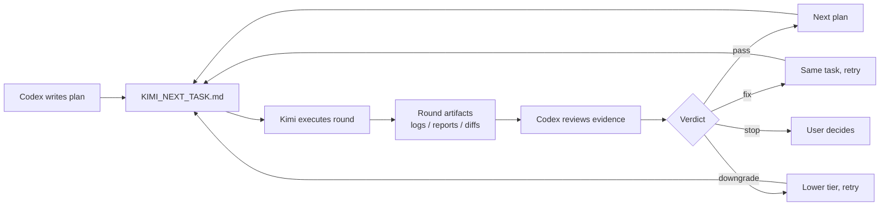

# Kimi-Codex Workflow Kit

> **Kimi does the work. Codex reviews the evidence.**

A no-install, drop-in workflow kit that turns any coding project into a Kimi-Codex managed project. Kimi executes in bounded rounds, Codex reviews the evidence, and everything is tracked through files - not long chat threads.

---

## The Problem

Stop copy-pasting long chats between Kimi and Codex.

Most AI-assisted workflows either:
- Dump everything into one chat window and lose context, or
- Require you to manually copy code back and forth.

This kit replaces that with **file-based handoffs**:
- Codex writes the plan into `KIMI_NEXT_TASK.md`.
- Kimi reads it, executes, and writes evidence into round reports.
- Codex reviews the evidence, records a verdict, and writes the next task.

Every decision is traceable. Every round leaves artifacts. Nothing lives only in chat memory.

---

## How It Works



---

## 60-Second Quickstart

No package install. No Python required for the portable path. PowerShell is recommended for the optional helper scripts.

Follow this 60-second quickstart to get started:

1. **Copy** `portable/kimi-codex-kit/` into your project root.
2. **Tell Codex**:
   ```text
   Read kimi-codex-kit/START_HERE.md and help me create the first Kimi task.
   ```
3. **Tell Kimi**:
   ```text
   Read kimi-codex-kit/KIMI_NEXT_TASK.md and execute it against this project.
   ```
4. **Return to Codex**:
   ```text
   Kimi is done. Review the result.
   ```

Prefer scripts? Initialize a task and generate a Kimi prompt with:

   ```powershell
   powershell -ExecutionPolicy Bypass -File kimi-codex-kit/tools/ai-kimi-init.ps1 -Task "Refactor auth module" -Tier T2
   powershell -ExecutionPolicy Bypass -File kimi-codex-kit/tools/ai-kimi-run.ps1 -NoRun
   ```

After Codex reviews the result, you can record a verdict:

   ```powershell
   powershell -ExecutionPolicy Bypass -File kimi-codex-kit/tools/ai-kimi-verdict.ps1 -Verdict pass
   ```

That's it. The scripts handle round numbering, artifact collection, and state tracking when you choose to use them.

---

## What the Kit Contains

| Path | Purpose |
|---|---|
| `START_HERE.md` | Overview for Codex and Kimi. |
| `README.md` | Kit-local quickstart and concepts. |
| `KIMI_CODEX_LOOP.md` | Full workflow documentation. |
| `CODEX_CONTINUE.md` | Bootstrap for fresh Codex threads. |
| `KIMI_NEXT_TASK.md` | Current task for Kimi to execute. |
| `tools/ai-kimi-init.ps1` | Initialize a new task and create handoff files. |
| `tools/ai-kimi-run.ps1` | Create a numbered round, run Kimi, capture artifacts. |
| `tools/ai-kimi-review-pack.ps1` | Print the latest compact review pack. |
| `tools/ai-kimi-verdict.ps1` | Record a Codex review verdict. |
| `skills/kimi-codex-worker.md` | Kimi worker skill reference. |
| `.ai/active_task/` | Workflow state, progress board, and round history. |

Workflow state lives inside the kit. Your parent project is only changed by the actual work you ask Kimi/Codex to perform.

---

## How Is This Different from Just Copying Skills?

Copying a skill into your repo gives Kimi rules. This kit gives you a **process**:

| Just a skill | This kit |
|---|---|
| Kimi has guidelines | Kimi has guidelines **and** a bounded task |
| No round tracking | Every round is numbered, logged, and reviewed |
| Codex has to plan from scratch | Codex resumes from handoff files |
| No evidence standard | Tests, diffs, and logs are required evidence |
| Chat memory is the source of truth | Files are the source of truth |

---

## When to Use / When Not to Use

**Use this when:**
- You want structured AI-assisted development with review gates.
- You work in rounds (features, refactors, bug fixes) that need oversight.
- You want evidence-based handoffs instead of chat-based context.

**Do not use this when:**
- You need a one-shot answer (just ask Kimi directly).
- Your project is tiny and does not benefit from round tracking.
- You do not have access to both Kimi and Codex.

---

## Optional: Python CLI

If you prefer a Python-based installer, this repo also provides `gpt2whatever`, a CLI that can install the workflow kit into the current project.

```bash
pip install -e .
gpt2whatever --install --yes --project-name MyApp --test-command "pytest"
```

This is the same kit, just installed through a Python package instead of copied manually. The portable folder method is recommended for most users.

---

## Safety Model

- **Kimi executes. Codex reviews.** Kimi does not have final say; Codex owns quality.
- **Kimi does not commit by default.** Git history remains under user/Codex control.
- **Reports, tests, and diffs are evidence.** Every claim must be backed by files, not narration.
- **Tiered execution:** T3 free / T2 bounded / T1 precise / T0 inspect-only.
- **All-or-nothing safety:** The installer aborts if any target already exists or any path is unsafe.

---

## Current Status & Roadmap

| Feature | Status |
|---|---|
| Portable no-install kit | Available in `portable/kimi-codex-kit/` |
| Python CLI installer | Available via `pip install -e .` |
| Token usage tracking | JSONL parsing and metrics helpers |
| Round artifacts (logs, reports, diffs) | Generated by helper scripts per round |
| Codex verdict recording | Pass / same-tier-fix / downgrade / stop |
| Future: doctor command | Planned: check kit health and common issues |
| Future: packaged release | Planned: PyPI and standalone zip |
| Future: example projects | Planned: sample repos showing T1/T2/T3 rounds |

---

## License

MIT
