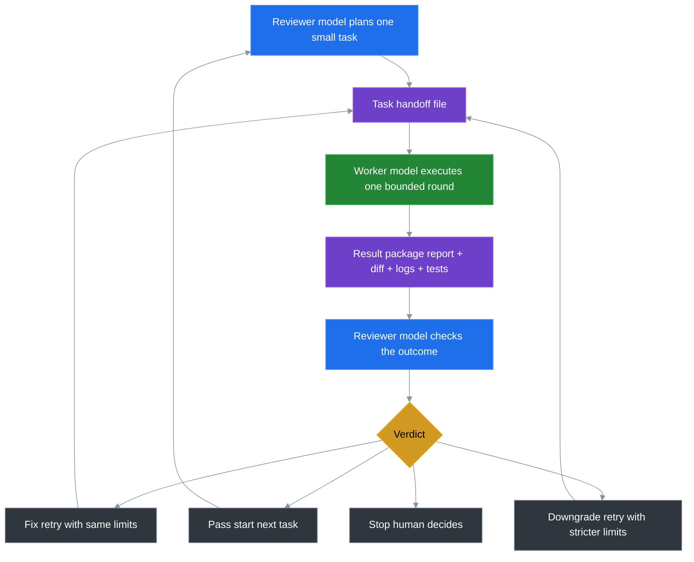

# Token Saver Loop

**Slogan: Split AI model roles, reduce premium model token bills by up to 75%**

Languages: [English](README.md) | [中文](README.zh-CN.md) | [日本語](README.ja.md) | [한국어](README.ko.md)

---

## Quick Start (No Install)

Token Saver Loop is portable-only. You do not run an installer.

1. Copy `portable/token-saver-kit` from this repo into your own project root.

   Or run this from your own project root in CMD:

   ```cmd
   git clone --depth 1 https://github.com/ningbo00/token-saver-loop.git .token-saver-loop && xcopy ".token-saver-loop\portable\token-saver-kit" "token-saver-kit" /E /I
   ```

2. Send this fixed prompt to the reviewer model:

```text
Read token-saver-kit/START_HERE.md and act only as the reviewer/planner.
Do not modify parent-project source code.
Create the next safe worker task and prepare the worker handoff files.
```

3. Send this fixed prompt to the worker model:

```text
Read the latest token-saver-kit/.ai/active_task/rounds/round_NNN/worker_prompt.md and execute the task against this project.
Do not commit. Stay inside the stated scope and write the required worker reports.
```

4. After the worker finishes, send this fixed prompt back to the reviewer model:

```text
The worker is done. Review the latest round evidence.
Do not modify parent-project source code. Decide pass, fix, downgrade, or stop.
```

---

## I. Core User Pain Points

When using mainstream premium general-purpose models like GPT and Claude for code iteration, repo exploration, and documentation drafting, you almost always run into three seemingly unsolvable problems:

1. **Runaway Bills**: Over 70% of premium token spend goes to low-value manual work like file retrieval, repeated debugging, and progress reporting, while decision-making accounts for only a tiny fraction of the cost.

2. **Task Drift**: A single model working alone tends to deviate from the original requirements as the conversation context grows longer, leading to excessive code changes.

3. **Knowledge Loss**: Session memory is temporary and fragile. Project review standards and lessons learned cannot be reused across sessions, so you have to re-explain everything every time.

---

## II. Core Benefit (Single Primary Benefit: Reduce Premium Model Token Consumption)

The core underlying logic: **We are not reducing AI workload; we are preventing the most expensive model from doing manual labor, forcibly driving down the premium token bill.**

All other capabilities are incidental gains and do not define the project's core positioning.

| Core Benefit | Practical Effect |
|---|---|
| **Dramatic Premium Token Cost Reduction** | Shift 90% of the expensive model's wasted token consumption to a low-cost model, directly lowering the **premium bill by 75%** for routine AI development tasks. |

---

## III. Real Cost-Saving Data Estimates

### 3.1 Same-Task Cost Comparison

Taking a routine code optimization task as an example: originally, a single premium model consumed 8,000 tokens for the full workflow. After adopting the loop, the cost comparison is as follows:

| Work Item | Traditional Single Model (Premium Tokens) | Token Saver Loop (Premium Tokens) |
|---|---|---|
| Task planning, risk assessment, final acceptance | 2,000 | 2,000 |
| Repo retrieval, batch source-code reading | 2,400 | 0 (handled by low-cost execution model) |
| Code edits, bug retries, passing tests | 2,800 | 0 (handled by low-cost execution model) |
| Process logs, progress reports | 800 | 0 (handled by local file system) |
| **Total Premium Tokens** | **8,000** | **2,000 (75% reduction)** |

Benefit Boundary: The larger the execution workload and the more the reviewer inspects only core results, the more obvious the savings. One-off extremely short tasks yield almost no benefit.

### 3.2 High-Fit Task List (Priority Use)

| Task Scenario | Cost-Saving Principle |
|---|---|
| Large repo source exploration, dependency mapping | Low-cost model traverses hundreds of files; premium model only reviews the final summary. |
| Global batch renaming, comment standardization | Low-cost model applies fixed patterns in bulk; premium model spot-checks diff risks. |
| API integration, iterative debug loops | Low-cost model absorbs repeated retries; premium model only reviews the final error. |
| Multilingual document drafts, long-document authoring | Low-cost model fills in content; premium model verifies structure and terminology. |

---

## IV. Fit / Not-Fit Scenarios (Quick Self-Check)

### ✅ Good Fit

- You need to separate execution and review into two models to prevent AI from breaking code.

- You maintain multiple code repositories and want a unified AI development standard.

- You are tired of endlessly long chat contexts and want task records preserved permanently in local files.

- You need to strictly limit the number of files AI can modify and prevent unauthorized changes to core configurations.

### ❌ Not Needed

- One-off short Q&A or single-file tiny changes that can be completed in one conversation turn.

- You have no need for cost reduction, risk control, or knowledge reuse.

---

## V. Minimal Three-Party Role Division

The framework is **completely model-agnostic, unbound, and has no deployment dependencies**. In plain terms, we only need two categories of large models, without tying to specific products:
1. Low-cost general-purpose model or CLI (execution side).
2. High-tier reasoning model (review side).

- **Execution Model (Worker)**: Pure manual labor. File retrieval, code editing, test execution, error retry, log/diff output. Has no final decision-making authority.

- **Review Model (Reviewer)**: Pure decision-making and control. Breaks tasks into fine-grained pieces, defines operation boundaries, checks modification results, and delivers the final verdict.

- **Local File System**: Durable memory carrier. Stores task work orders, modification diffs, review logs, and project rules, replacing fragile chat context.

---

## VI. 60-Second Zero-Barrier Onboarding (Plain Explanation: How Ordinary People Use It)

**One-sentence usage principle**: No software installation, no coding, no key configuration. Just copy one folder from the project, open two AI web pages, paste one fixed phrase into each, and the whole loop is ready. Everything flows through local files; existing code is not touched.

### Minimal 4-Step Onboarding (Plain language + copy-paste commands combined, no need to switch back and forth)

1. **Step 1 (Local Prep)**: Copy the `portable/token-saver-kit` folder from this repo and paste it into your own project's root directory.

2. **Step 2 (Reviewer assigns task)**: Open a high-tier reasoning model and paste the reviewer start prompt below. It must plan only and must not edit project source files.

3. **Step 3 (Worker executes)**: Open the worker model and paste the worker handoff prompt prepared by the reviewer.

4. **Step 4 (Reviewer accepts)**: Switch back to the high-tier reasoning model and paste the reviewer review prompt below.

### Fixed Prompts To Reuse

Reviewer start:

```text
Read token-saver-kit/START_HERE.md and act only as the reviewer/planner.
Do not modify parent-project source code.
Create the next safe worker task and prepare the worker handoff files.
```

Worker execution:

```text
Read the latest token-saver-kit/.ai/active_task/rounds/round_NNN/worker_prompt.md and execute the task against this project.
Do not commit. Stay inside the stated scope and write the required worker reports.
```

Reviewer review:

```text
The worker is done. Review the latest round evidence.
Do not modify parent-project source code. Decide pass, fix, downgrade, or stop.
```

---

## VII. Core Kit File Descriptions

Kit state is stored independently; **by default, it will not actively modify existing project code.**

| File Path | Core Purpose |
|---|---|
| `START_HERE.md` | Unified entry point for both models; defines basic usage constraints. |
| `WORKER_NEXT_TASK.md` | The specific task issued to the execution model for the current round. |
| `REVIEWER_CONTINUE.md` | Context bootstrap file when starting a new review session. |
| `.ai/active_task/` | Local storage for round logs, modification diffs, and verdict results. |
| `tools/` | Task initialization and batch review helper scripts. |

---

## VIII. Complete Closed-Loop Workflow (Understand it; no manual operation needed)

Workflow summary: Reviewer breaks down task → File handoff → Execution → Result package produced → Reviewer four-way verdict → Loop iteration.



Verdict branch explanation: Pass / same-tier fix / tighten-permissions downgrade / human stop. Four closed-loop branches with no omissions.

---

## IX. Quality, Risk, and Long-Term Concern Answers

Beyond cost reduction, users care most about four hidden concerns: Will cheaper execution sacrifice code quality? Will tasks drift off course? Can knowledge be reused? Can it be used across multiple projects? The following full set of guarantees comes at no extra cost and adds no token consumption:

1. **Prevent Task Drift**: Each round limits file modification scope and operation permissions, blocking the model's unbounded free improvisation and solving long-conversation requirement drift.

2. **Eliminate Self-Review Blind Spots**: Execution and review models are physically separated, avoiding the common problems of a single model self-editing and self-reviewing, missing bugs, and self-whitewashing.

3. **Long-Term Compounding Efficiency (incidental cost-reduction gain)**: With continued use, the project accumulates AI calling rules and pitfall standards, so there is no need to re-brief the model each time, further implicitly reducing wasted token consumption.

4. **Zero-Cost Cross-Project Reuse**: No framework dependency; copy the portable kit to plug into any repo and unify the AI development standard across all repositories.

The original standalone safety and risk-control items have been streamlined and merged with quality concerns to avoid content fragmentation:

1. **Permission Separation and Anti-Mistake Changes**: The execution model has no final decision-making authority; all changes must be reviewed and verified. Automatic Git commits are disabled by default.

2. **Four-Level Permission Safety Net**: Starting from read-only T0, modification permissions are released step by step, preventing unauthorized changes to core configurations.

3. **Result-Oriented Verification**: Only code diffs and test logs are verified; the model's verbal reports are not trusted, avoiding narrative deception.

4. **Portable Removal**: Runtime state stays inside `token-saver-kit/`, so removing the loop is just deleting that folder.

---

## X. Advanced Usage (99% of beginners can skip this)

### 10.1 Minimal Safe Example

See `examples/minimal-task.md` for a zero-code-change T0 repo inspection task, suitable for first-time process verification.

### 10.2 Developer Helpers

The Python package contains optional diagnostics and metrics helpers for contributors. Ordinary users do not need them for the portable workflow.

---

## XI. Beginner FAQ

- **Q: Must I use a specific worker + reviewer model pair?** A: Absolutely not. The kit only uses them as default examples. Any "low-cost execution model + premium review model" pair can be substituted without changing any internal kit files.

- **Q: Will it pollute existing project files?** A: All runtime data lives inside the kit's internal `.ai` directory. By default, the kit only reads source code and does not actively write to project business files.

- **Q: Where can I learn if I don't understand the workflow?** A: Pure beginners should read **docs/BEGINNER_GUIDE.md** for a step-by-step illustrated tutorial.

---

## XII. Project Status and Open-Source License

### 12.1 Feature Progress

| Feature | Status |
|---|---|
| No-install portable kit | Completed (portable directory) |
| Beginner illustrated guide and minimal example | Completed |
| Python CLI doctor and token metrics | Completed |
| Cross-model generic templates and task diagnostics | Planned |

### 12.2 License

MIT License, allowing free commercial use and redistribution with modifications.

> (Note: Some parts of this document may be AI-generated.)


