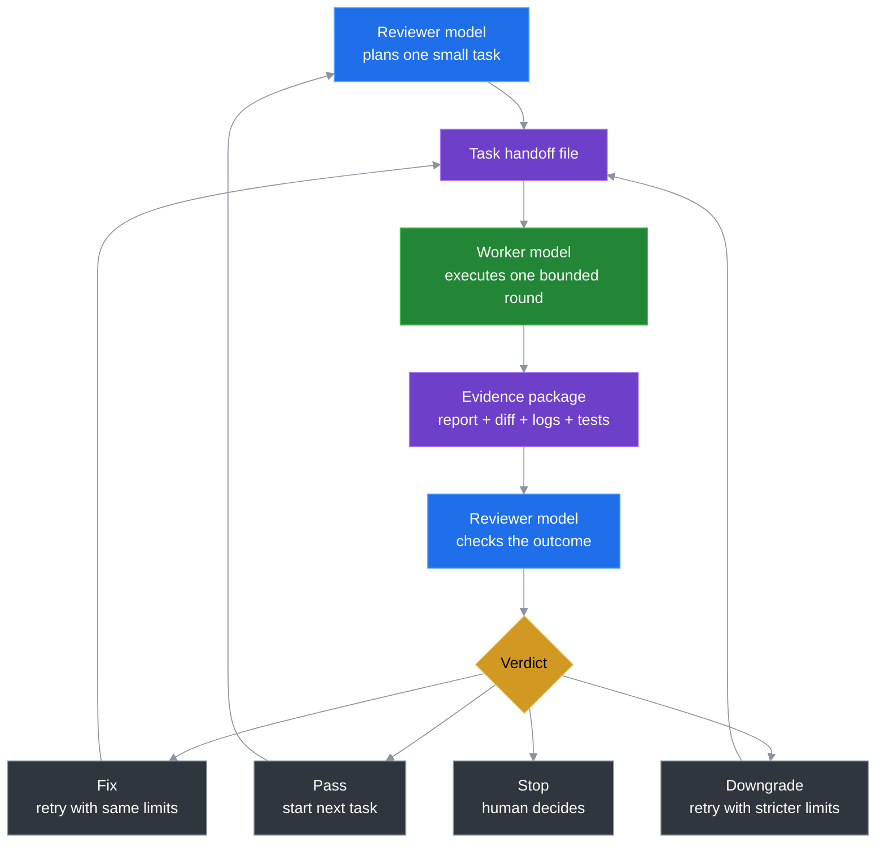

# Token Saver Loop

> Move search, execution, retries, and memory out of the expensive model loop. Keep planning and final review in the expensive model's hands.

Languages: [English](README.md) | [中文](README.zh-CN.md) | [日本語](README.ja.md) | [한국어](README.ko.md)

Token Saver Loop is a portable workflow for using two AI roles on one coding project:

```text
Worker model   = searches, edits, runs checks, retries, writes results
Reviewer model = plans, sets limits, reviews results, decides pass/fix/stop
File system    = stores memory, tasks, reports, diffs, logs, verdicts
```

The default setup is **Kimi as worker + Codex as reviewer**, but the idea is model-agnostic. The important part is the loop, not the brand names.

## 1. Where The Tokens Are Saved

The tokens are saved from the expensive model's low-value workload.

In a normal one-model coding workflow, your strongest model often does everything:

```text
read broad context -> search files -> edit -> run tests -> hit errors -> retry -> explain -> repeat next turn
```

That burns premium tokens on work that is not really premium judgment:

- broad repo search
- trial-and-error edits
- repeated test/debug loops
- replaying long chat history
- progress narration and status recap

Token Saver Loop changes the cost structure:

```text
Expensive model: planning, constraints, acceptance, risk judgment
Worker model:    search, execution, retries, command output, reports
File system:     durable memory instead of long chat context
```

So the saving is not magic. You stop paying the strongest model to grind through the whole execution loop. You pay it mainly for the decisions that actually need it.

## 2. Why The Loop Is Reliable

The loop is reliable because the worker is allowed to execute, but not allowed to decide.

This is the key difference from simply using a cheaper model directly. The worker can search, edit, test, and retry, but the reviewer still controls:

- what the task is
- how much freedom the worker gets
- whether the result is accepted
- whether the next round should fix, downgrade, or stop

Compared with using one strong model end-to-end, Token Saver Loop avoids several reliability traps:

| Risk in one-model workflow | Loop answer |
|---|---|
| The same model does the work and reviews its own work. | Worker executes; reviewer judges from outside the execution path. |
| A large task drifts over time. | Each round is bounded by task scope and tier. |
| The model rationalizes its own failed attempt. | Failure becomes a control action: fix, downgrade, or stop. |
| Long chats dilute the original requirements. | Current task, state, and review rules live in files. |
| Mistakes can spread through a broad edit. | Round limits reduce the blast radius. |

The quality does not come from trusting the worker. It comes from using the worker for labor while keeping judgment, acceptance, and risk control with the reviewer.

## 3. Why It Gets Better Over Time

Token Saver Loop improves because each round turns experience into reusable project knowledge.

A normal chat gets longer and noisier. This loop should get sharper. Over time, the project accumulates better answers to questions like:

- What task size works best?
- Which folders should the worker avoid?
- Which tests must run for this kind of change?
- What mistakes does this worker often make?
- When should reviewer downgrade from T2 to T1?
- What does a good task handoff look like for this repo?

That means future rounds start with better boundaries than earlier rounds. The improvement is not stored in one model's fragile chat memory; it is stored in project files, task templates, review habits, and accumulated rules.

In short:

```text
The model does not need to magically remember more.
The project learns how to use models better.
```

## New Here?

If you are new to GitHub, Codex/Kimi workflows, or command-line tools, start here:

```text
docs/BEGINNER_GUIDE.md
```

That guide walks through the simplest path: copy the kit, ask Codex for a safe first task, ask Kimi to run it, then ask Codex to review the result.

## The Basic Loop



## 60-Second Quickstart

No Python required. No package install required. PowerShell helper scripts are optional.

1. Copy this folder into another project:
   ```text
   portable/kimi-codex-kit/
   ```

2. In Codex, say:
   ```text
   Read kimi-codex-kit/START_HERE.md and create a safe first worker task.
   ```

3. In Kimi, say:
   ```text
   Read kimi-codex-kit/KIMI_NEXT_TASK.md and execute it against this project.
   ```

4. Back in Codex, say:
   ```text
   The worker is done. Review the latest round evidence.
   ```

Prefer scripts? Generate the worker prompt without running Kimi:

```powershell
powershell -ExecutionPolicy Bypass -File kimi-codex-kit/tools/ai-kimi-init.ps1 -Task "Inspect this project and summarize the structure" -Tier T0
powershell -ExecutionPolicy Bypass -File kimi-codex-kit/tools/ai-kimi-run.ps1 -NoRun
```

## What You Copy Into a Project

| Path | Purpose |
|---|---|
| `START_HERE.md` | First file for reviewer/worker models to read. |
| `KIMI_NEXT_TASK.md` | The current bounded worker task. |
| `CODEX_CONTINUE.md` | Fresh reviewer-thread bootstrap. |
| `KIMI_CODEX_LOOP.md` | Full workflow notes for the default Kimi/Codex setup. |
| `tools/` | Optional PowerShell helpers for init, run, review pack, verdict. |
| `skills/kimi-codex-worker.md` | Default worker instructions for Kimi. |
| `.ai/active_task/` | Kit-local state, progress, and round history. |

The copied kit keeps its workflow state inside `kimi-codex-kit/.ai/`, so your parent project is only changed by the actual task you approve.

## Example First Task

See `examples/minimal-task.md` for a safe T0 inspect-only task. It asks the worker to summarize a project without changing source code.

## Optional Python CLI

The portable folder is the recommended path. If you prefer a Python installer:

```bash
pip install -e .
token-saver-loop --install --yes --project-name MyApp --test-command "pytest"
```

## When To Use It

Use Token Saver Loop when:

- You want one model to execute and another model to review.
- You need a repeatable AI development process across multiple repos.
- You want evidence-based handoffs instead of long chat memory.
- You want stricter control over worker freedom and changed files.

Skip it when:

- You only need a one-shot answer.
- The task is tiny enough for one model in one chat.
- You do not need token savings, review gates, or file-based history.

## Safety Model

- **Worker executes; reviewer judges.** The worker does not get final say.
- **No default commits.** Git history remains under human/reviewer control.
- **Review from results, not self-belief.** The reviewer checks the outcome instead of trusting the worker's confidence.
- **Tiered freedom.** T0 inspect-only, T1 precise, T2 bounded, T3 broad.
- **Installer safety.** Real install requires `--yes` and uses no-overwrite checks.

## Project Status

| Feature | Status |
|---|---|
| Portable no-install kit | Available in `portable/kimi-codex-kit/` |
| Beginner guide | Available in `docs/BEGINNER_GUIDE.md` |
| Minimal example | Available in `examples/minimal-task.md` |
| Python CLI installer | Available via `pip install -e .` |
| Token usage helpers | JSONL parsing and metrics helpers |
| Reviewer verdicts | Pass / same-tier-fix / downgrade / stop |
| Future: doctor command | Planned |
| Future: model-agnostic templates | Planned |

## License

MIT
