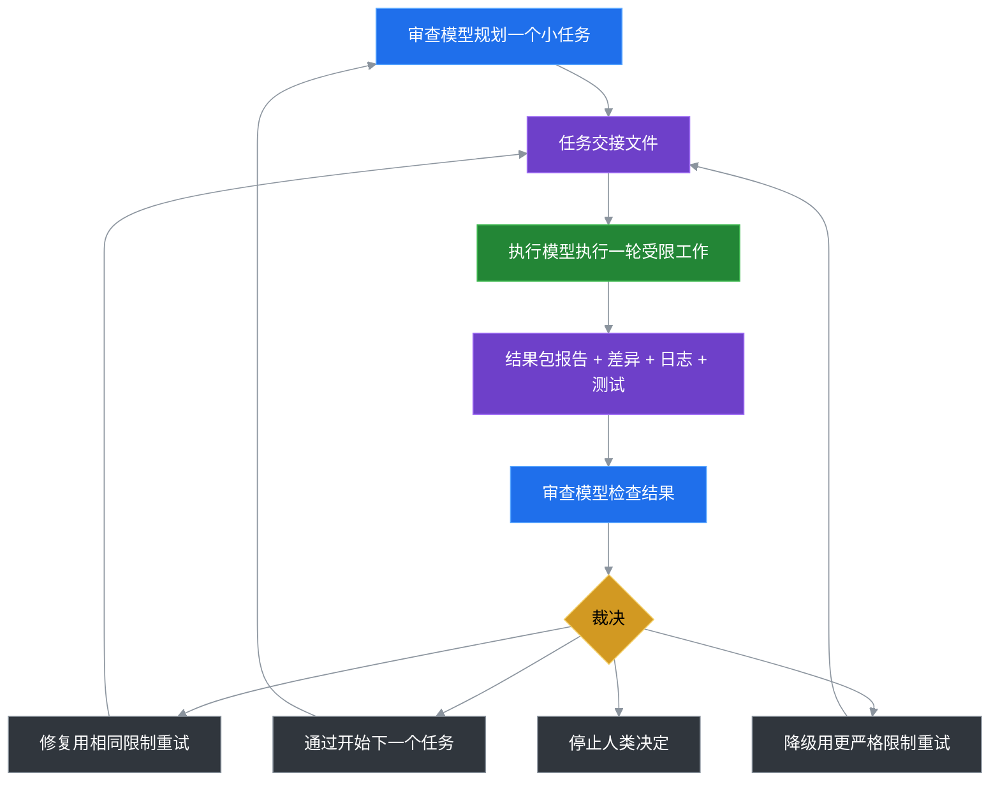

# Token Saver Loop

**Slogan：拆分AI模型分工，最高降低75%高价模型Token账单**

Languages: [English](README.md) | [中文](README.zh-CN.md) | [日本語](README.ja.md) | [한국어](README.ko.md)

---

## 快速开始（无需安装）

Token Saver Loop 是 portable-only 工具，不需要运行安装器。

1. 把本仓库的 `portable/token-saver-kit` 复制到你的项目根目录。
2. 对审查模型发送：`Read token-saver-kit/START_HERE.md and create a safe first worker task.`
3. 准备一轮 worker 执行：

```powershell
powershell -ExecutionPolicy Bypass -File token-saver-kit/tools/tsl-run.ps1 -WorkerCommand deepseek
```

可以把 `deepseek` 换成你实际使用的 worker CLI 命令。只预览提示词、不创建真实轮次：

```powershell
powershell -ExecutionPolicy Bypass -File token-saver-kit/tools/tsl-run.ps1 -NoRun
```

可选健康检查：

```bash
token-saver-loop --doctor
```

---

## 一、用户核心痛点

使用GPT、Claude等主流高价通用大模型做代码迭代、仓库梳理、文档编撰时，几乎都会遇到三类无解问题：

1. **账单失控**：70%以上高价Token消耗在文件检索、反复调试、进度汇报等低价值体力环节，决策只占极少开销

2. **任务发散**：单模型自给自足，对话上下文越长，越容易偏离原始需求、过度修改代码

3. **经验流失**：会话记忆临时且脆弱，项目审查标准、踩坑记录无法跨会话复用，每次使用都要重复交底

---

## 二、核心收益（唯一主收益：降低高价模型Token消耗）

核心底层逻辑：**不是减少AI工作量，而是不让最贵的模型做体力活，硬性压低高价Token账单**

所有其他能力均为附带增益，不属于项目核心定位

|核心收益|落地效果|
|---|---|
|**高价Token大幅降本**|把高价模型90%的无效Token消耗转移给低价模型，常规AI开发任务直接降低**75%高价账单**|

---

## 三、真实降本数据测算

### 3.1 同任务开销对比

以常规代码优化任务为例，原单高价模型全流程消耗8000Token，改造后开销对比如下：

|工作内容|传统单模型（高价Token）|Token Saver Loop（高价Token）|
|---|---|---|
|任务规划、风险判定、最终验收|2000|2000|
|仓库检索、批量读取源码|2400|0（低成本执行模型承接）|
|代码修改、bug重试、测试跑通|2800|0（低成本执行模型承接）|
|过程日志、进度汇报|800|0（本地文件系统承接）|
|**高价Token总计**|**8000**|**2000（降幅75%）**|

收益边界：执行工作量越大、审查只抽查核心结果，降本越明显；一次性极简短任务几乎无收益

### 3.2 高适配任务清单（优先使用）

|任务场景|降本原理|
|---|---|
|大型仓库源码探索、依赖梳理|低价模型遍历百级文件，高价模型仅查看最终梳理结论|
|全局批量命名、注释统一|低价模型批量执行固定模式，高价模型抽查diff风险|
|接口联调、循环debug|低价模型承接反复重试，高价模型只复盘最终报错|
|多语言文档初稿、长文档编撰|低价模型填充内容，高价模型校验结构、专业术语|

---

## 四、适配/不适配场景（快速自我判断）

### ✅ 适合使用

- 需要分离执行、审查双模型，规避AI改错代码

- 同时维护多个代码仓库，想要统一AI开发规范

- 厌倦超长聊天上下文，希望用本地文件永久留存任务记录

- 需要严格限制AI修改文件数量、禁止越权改动核心配置

### ❌ 无需使用

- 一次性简短问答、单文件微小修改，一轮对话即可完成

- 无降本、风险管控、经验复用需求

---

## 五、三方角色极简分工

框架**完全模型无关、无绑定、无部署依赖**。通俗角色划分：我们只需要两类大模型，无需绑定特定产品：
1\. 低成本通用大模型（执行端：Kimi/通义千问等）
2\. 高阶推理大模型（审查端：GPT/Claude等）

- **执行模型（Worker）**：纯体力执行。文件检索、代码编辑、测试运行、报错重试、产出日志diff，无最终决策权

- **审查模型（Reviewer）**：纯决策管控。拆分细粒度任务、划定操作边界、核查改动结果、给出最终裁决

- **本地文件系统**：永久记忆载体。存储任务工单、改动diff、审查日志、项目规则，替代易丢失聊天上下文

---

## 六、60秒零门槛上手（直白说明：普通人怎么用）

**一句话使用原理**：不用安装软件、不用写代码、不用配置密钥。仅复制项目内一个文件夹，打开两个AI网页，分别粘贴一句固定话术，即可完成整套循环。全程本地文件流转，不改动原有代码。

### 极简4步上手（人话+复制指令二合一，无需来回切换）

1. **步骤1（本地准备）**：将仓库内 `portable/token-saver-kit` 文件夹，复制粘贴到你自己的项目根目录

2. **步骤2（审查模型下发任务）**：打开高阶推理大模型，直接复制发送：`Read token-saver-kit/START_HERE.md and create a safe first worker task.`

3. **步骤3（执行模型干活）**：优先运行 `powershell -ExecutionPolicy Bypass -File token-saver-kit/tools/tsl-run.ps1` 生成真实 `round_NNN` 提示词。手动使用时，打开低成本大模型，直接复制发送：`Read token-saver-kit/WORKER_NEXT_TASK.md and execute it against this project.`

4. **步骤4（审查模型验收）**：切回高阶推理大模型，直接复制发送：`The worker is done. Review the latest round evidence.`

### 可选：PowerShell快捷生成任务（无需手动输入话术）

```powershell
# 初始化仓库梳理任务
powershell -ExecutionPolicy Bypass -File token-saver-kit/tools/tsl-init.ps1 -Task "Inspect this project and summarize the structure" -Tier T0
# 使用任意兼容的 worker CLI 运行，或替换为 deepseek/glm/qwen 等命令
powershell -ExecutionPolicy Bypass -File token-saver-kit/tools/tsl-run.ps1 -WorkerCommand deepseek
# 只预览提示词，不创建真实轮次
powershell -ExecutionPolicy Bypass -File token-saver-kit/tools/tsl-run.ps1 -NoRun
```

`-NoRun` 只写入 `_validate` 预览提示词。正式执行时去掉 `-NoRun`，生成真实 `round_NNN` 轮次。

在任意项目根目录进行健康检查：

```bash
token-saver-loop --doctor
```

---

## 七、套件核心文件说明

套件状态独立存储，**默认不会主动修改项目原有代码**

|文件路径|核心用途|
|---|---|
|`START_HERE.md`|双模型统一入口，定义基础使用约束|
|`WORKER_NEXT_TASK.md`|当前轮次下发给执行模型的具体任务|
|`REVIEWER_CONTINUE.md`|新建审查会话时的上下文引导文件|
|`.ai/active_task/`|本地存储轮次日志、改动diff、裁决结果|
|`tools/`|任务初始化、批量审查辅助脚本|

---

## 八、完整闭环工作流（看懂即可，无需手动操作）

流程简述：审查拆分任务→文件交接→执行落地→产出结果包→审查四向裁决→循环迭代



裁决分支说明：通过/同级修复/收紧权限降级/人工终止，四类闭环无遗漏

---

## 九、质量、风险与长期顾虑解答

用户在降本之外最关心4个隐性顾虑：降本会不会牺牲代码质量？会不会任务跑偏？经验能不能复用？能不能多项目通用。以下为全套附带保障，无需额外付费、不增加Token消耗：

1. **避免任务失控（防跑偏）**：每轮任务限定文件修改范围、操作权限，阻断模型无边界自由发挥，解决长对话需求偏离问题

2. **消除自审盲区（保质量）**：执行、审查模型物理分离，规避单模型自改自审、忽略漏洞、自我美化的通病

3. **长期复利提效（附带降本增益）**：随着使用，项目会沉淀AI调用规则、踩坑标准，后续无需重复向模型交底，进一步隐性减少无效Token消耗

4. **零成本跨项目复用**：无框架依赖，复制便携套件即可接入任意仓库，统一全仓库AI开发标准

原有独立安全风控条目精简合并，和质量顾虑打通，避免内容割裂：

1. **权限分离与防误改**：执行模型无最终决策权，所有改动必须审查核验，默认禁止自动Git提交

2. **四级权限兜底**：从只读T0起步，逐级放开修改权限，杜绝越权改动核心配置

3. **结果导向核验**：只校验代码diff、测试日志，不采信模型口头汇报，规避话术造假

4. **便携删除**：运行状态保存在 `token-saver-kit/` 内部，移除循环只需要删除这个文件夹。

---

## 十、进阶用法（新手99%用不到，直接跳过）

### 10.1 最小安全示例

查看 `examples/minimal-task.md`，提供零代码改动的T0仓库巡检任务，适合首次测试验证流程

### 10.2 Python CLI辅助工具

```bash
token-saver-loop --doctor
token-saver-loop --project-name MyApp --show-config
```

Python CLI 是可选辅助工具，不会把文件安装进你的项目。主要用于诊断、指标和配置预览。

---

## 十一、新手高频FAQ

- **Q：必须用某个特定 worker + reviewer 模型组合吗？** A：完全不需要。套件只是默认举例，任意「低价执行模型+高价审查模型」都能替换，不用改动套件内部文件

- **Q：会不会污染原有项目文件？** A：所有运行数据存在套件内部\.ai目录，默认仅读取源码，不主动写入项目业务文件

- **Q：看不懂流程去哪里学习？** A：纯新手直接阅读 **docs/BEGINNER\_GUIDE\.md**，图文分步教学

---

## 十二、项目状态与开源许可

### 12.1 功能进度

|功能|状态|
|---|---|
|免安装便携套件|已完成（portable目录）|
|新手图文指南、最小示例|已完成|
|Python CLI doctor、Token指标统计|已完成|
|跨模型通用模板、任务诊断命令|规划中|

### 12.2 许可

MIT License，允许自由商用、二次修改分发

> （注：文档部分内容可能由 AI 生成）
