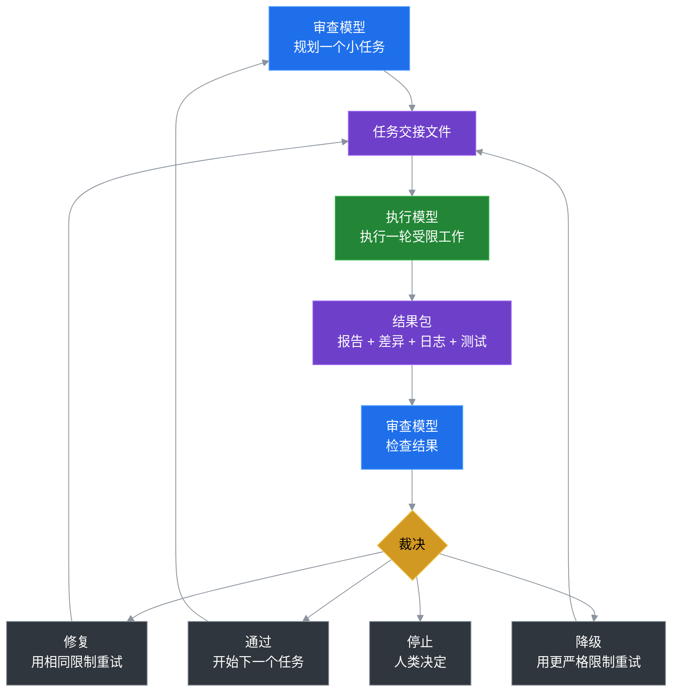

# Token Saver Loop

> 把搜索、执行、重试和记忆交给便宜的模型。把规划和最终审查留给昂贵的模型。

Languages: [English](README.md) | [中文](README.zh-CN.md) | [日本語](README.ja.md) | [한국어](README.ko.md)

Token Saver Loop 是一个可移植的工作流，让你在同一项目中使用两种 AI 角色：

```text
执行模型   = 搜索、编辑、运行检查、重试、写入结果
审查模型   = 规划、设定限制、审查结果、决定通过/修复/停止
文件系统   = 存储记忆、任务、报告、差异、日志、裁决
```

默认配置是 **Kimi 执行 + Codex 审查**，但这个思路与具体模型无关。重要的是循环机制，而不是品牌名称。

## 1. Token 省在哪里

Token 的节省来自昂贵的审查模型不再做低价值工作。

在常规的单模型编程工作流中，你最强的模型通常包揽一切：

```text
读取大量上下文 -> 搜索文件 -> 编辑 -> 运行测试 -> 遇到错误 -> 重试 -> 解释 -> 下一轮重复
```

这会把高级 Token 烧在其实并不需要高级判断的工作上：

- 广泛的仓库搜索
- 试错式编辑
- 重复的测试/调试循环
- 重放长篇聊天记录
- 进度汇报和状态回顾

Token Saver Loop 改变了成本结构：

```text
昂贵模型: 规划、约束、验收、风险判断
执行模型: 搜索、执行、重试、命令输出、报告
文件系统: 持久化记忆，替代长聊天上下文
```

所以节省不是魔法。你只是不再让最强模型去啃完整条执行循环。你主要让它做真正需要它来做决策的部分。

## 2. 为什么这个循环可靠

循环可靠是因为执行者被允许执行，但不被允许决定。

这是与直接使用便宜模型的关键区别。执行者可以搜索、编辑、测试和重试，但审查者仍然控制：

- 任务是什么
- 执行者有多少自由度
- 结果是否被接受
- 下一轮应该修复、降级还是停止

相比单强模型端到端的方式，Token Saver Loop 规避了几个可靠性陷阱：

| 单模型工作流的风险 | 循环的解法 |
|---|---|
| 同一个模型既做工作又审查自己的工作。 | 执行者干活；审查者从执行路径外部评判。 |
| 大任务随时间漂移。 | 每轮都被任务范围和层级限制。 |
| 模型为自己的失败尝试合理化。 | 失败变成控制动作：修复、降级或停止。 |
| 长对话稀释原始需求。 | 当前任务、状态和审查规则都活在文件里。 |
| 错误可能通过大范围编辑扩散。 | 轮次限制减少爆炸半径。 |

质量不是来自信任执行者。而是来自让执行者做体力活，同时把判断、验收和风险控制留给审查者。

## 3. 为什么它会越用越好

Token Saver Loop 会改进，因为每一轮都在把经验变成可复用的项目知识。

普通聊天会变得越来越嘈杂。这个循环应该越来越锐利。随着时间推移，项目会积累对这些问题的更好答案：

- 什么任务尺寸效果最好？
- 执行者应该避开哪些文件夹？
- 这类改动必须跑哪些测试？
- 这个执行者经常犯什么错误？
- 审查者什么时候应该从 T2 降级到 T1？
- 这个仓库的好任务交接长什么样？

这意味着未来的轮次比早期轮次有更强的边界。改进不是存在某个模型的脆弱聊天记忆里；而是存在项目文件、任务模板、审查习惯和累积规则中。

简而言之：

```text
模型不需要神奇地记住更多。
项目学会了如何更好地使用模型。
```

## 刚接触？

如果你不熟悉 GitHub、Codex/Kimi 工作流或命令行工具，从这里开始：

```text
docs/BEGINNER_GUIDE.md
```

该指南会带你走最简单的路径：复制套件，让 Codex 给一个安全的初任务，让 Kimi 执行，然后让 Codex 审查结果。

## 基础循环



## 60 秒快速上手

不需要 Python。不需要安装包。PowerShell 辅助脚本是可选的。

1. 把这个文件夹复制到另一个项目里：
   ```text
   portable/kimi-codex-kit/
   ```

2. 在 Codex 里说：
   ```text
   Read kimi-codex-kit/START_HERE.md and create a safe first worker task.
   ```

3. 在 Kimi 里说：
   ```text
   Read kimi-codex-kit/KIMI_NEXT_TASK.md and execute it against this project.
   ```

4. 回到 Codex 里说：
   ```text
   The worker is done. Review the latest round evidence.
   ```

喜欢用脚本？不运行 Kimi 也能生成执行者提示：

```powershell
powershell -ExecutionPolicy Bypass -File kimi-codex-kit/tools/ai-kimi-init.ps1 -Task "Inspect this project and summarize the structure" -Tier T0
powershell -ExecutionPolicy Bypass -File kimi-codex-kit/tools/ai-kimi-run.ps1 -NoRun
```

## 你会复制到项目里的东西

| 路径 | 用途 |
|---|---|
| `START_HERE.md` | 审查/执行模型首先要读的文件。 |
| `KIMI_NEXT_TASK.md` | 当前受限的执行者任务。 |
| `CODEX_CONTINUE.md` | 新审查线程的引导文件。 |
| `KIMI_CODEX_LOOP.md` | 默认 Kimi/Codex 配置的完整工作流说明。 |
| `tools/` | 可选的 PowerShell 辅助脚本：初始化、运行、审查包、裁决。 |
| `skills/kimi-codex-worker.md` | Kimi 的默认执行者指令。 |
| `.ai/active_task/` | 套件本地状态、进度和轮次历史。 |

复制的套件把工作流状态保存在 `kimi-codex-kit/.ai/` 内部，所以父项目只被实际批准的任务改动。

## 示例初任务

查看 `examples/minimal-task.md` 了解一个安全的 T0 仅检查任务。它要求执行者总结项目而不改动源代码。

## 可选：Python CLI

可移植文件夹是推荐路径。如果你更喜欢 Python 安装器：

```bash
pip install -e .
token-saver-loop --install --yes --project-name MyApp --test-command "pytest"
```

## 什么时候用它

适合使用 Token Saver Loop 的情况：

- 你想让一个模型执行，另一个模型审查。
- 你需要一个在多个仓库之间可复用的 AI 开发流程。
- 你想要基于结果的交接，而不是长聊天记忆。
- 你想更严格地控制执行者自由度和改动文件数。

不适合的情况：

- 你只需要一个一次性答案。
- 任务小到一次聊天就能搞定。
- 你不需要省 Token、审查关卡或基于文件的历史记录。

## 安全模型

- **执行者干活；审查者评判。** 执行者没有最终发言权。
- **默认不提交。** Git 历史由人类/审查者控制。
- **从结果审查，而非自我信任。** 审查者检查结果，而不是信任执行者的自信。
- **分层自由度。** T0 仅检查、T1 精确、T2 受限、T3 广泛。
- **安装器安全。** 真实安装需要 `--yes` 并使用不覆盖检查。

## 项目状态

| 功能 | 状态 |
|---|---|
| 可移植免安装套件 | 可在 `portable/kimi-codex-kit/` 获取 |
| 新手指南 | 可在 `docs/BEGINNER_GUIDE.md` 获取 |
| 最小示例 | 可在 `examples/minimal-task.md` 获取 |
| Python CLI 安装器 | 可通过 `pip install -e .` 获取 |
| Token 使用辅助工具 | JSONL 解析和指标辅助 |
| 审查者裁决 | 通过 / 同级修复 / 降级 / 停止 |
| 未来：诊断命令 | 计划中 |
| 未来：模型无关模板 | 计划中 |

## 许可

MIT
